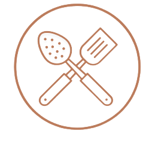

<!-- PROJECT LOGO -->

<br />
<div align="center">
  
  <h3 align="center">My Cookbook</h3>

  <p align="center">
  A MERN Stack Web App designed to allow users to
  create their own personal cookbooks by choosing
  from a variety of options given from my very own api!
    <br />
    <br />
    <br />
    <!-- Todo: Need to update links -->
    <a href="#">Visit Site</a>
    ·
    <a href="#">Client</a>
    ·
    <a href="https://github.com/Mihir9702/MyCookbookServer">Server</a>

  </p>
</div>

<!-- TABLE OF CONTENTS -->

<details>
  <summary>Table of Contents</summary>
  <ol>
    <li>
      <a href="#about-the-project">About The Project</a>
      <ul>
        <li><a href="#built-with">Built With</a></li>
      </ul>
    </li>
    <li>
      <a href="#getting-started">Getting Started</a>
      <ul>
        <li><a href="#installation">Installation</a></li>
      </ul>
    </li>
    <li><a href="#contact">Contact</a></li>
  </ol>
</details>

<!-- ABOUT THE PROJECT -->

## About The Project

<!-- Todo: Need to add my own image of site -->
<p align='center'>
  
</p>

Using `TheMealDB` I was able to build my own `REST API` to design an interactive web app for food enthusiasts
This idea came to me when I decided to set up a proper meal plan that involved me learning to cook, but then
I came to the realization that there was no app that suited my needs. It's no `Cloudy with a Chance of Meatballs`
but I am glad to create technology that guides the creation of food.

<p align="right">(<a href="#top">back to top</a>)</p>

## Built With

- [TypeScript](https://www.typescriptlang.org/)
- [React](https://reactjs.org/)
- [Express](https://expressjs.com/)
- [Node](https://nodejs.org/en/)
- [MongoDB](https://www.mongodb.com/)
- [Scss](https://sass-lang.com/)
- [Chakra-UI](https://chakra-ui.com/)
- [Snowpack](https://www.snowpack.dev/)

<p align="right">(<a href="#top">back to top</a>)</p>

<!-- GETTING STARTED -->

## Getting Started

Instructions on how to set up the project locally. To get a local copy up and running
follow these simple steps.

### Installation

Fork the project to your local repo

<br />
1. <b>Clone the repo</b>
<br />
<br />
FrontEnd

```sh
git clone https://github.com/Mihir9702/MyCookbookClient.git
```

<u>BackEnd</u>

```sh
git clone https://github.com/Mihir9702/MyCookbookServer.git
```

<br />
2. <b>Install NPM packages</b>
<br />

```sh
npm install
```

<br />
3. <b>There we go!</b>
<br />
<br />

FrontEnd

```sh
npm start
```

BackEnd

```sh
nodemon
```

<p align="right">(<a href="#top">back to top</a>)</p>

<!-- CONTACT -->

## Contact

Mihir Patel - [GitHub](https://github.com/Mihir9702) - [Linkedin](https://www.linkedin.com/in/mihir-k-patel/) - [Email](mihirkp7@gmail.com)

Project Links: [FrontEnd](https://github.com/Mihir9702/MyCookbookClient) - [BackEnd](https://github.com/Mihir9702/MyCookbookServer)

<p align="right">(<a href="#top">back to top</a>)</p>
